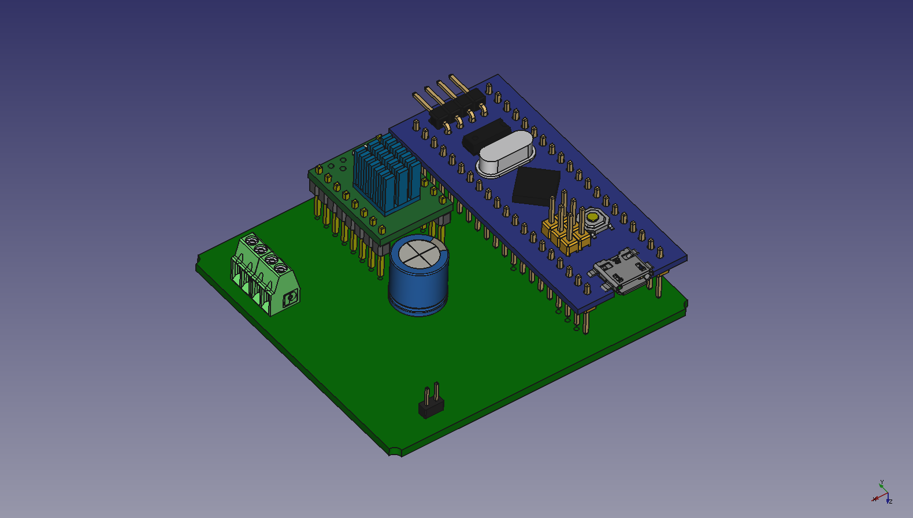

# ECAD Files

Designed with [KiCad EDA](http://kicad-pcb.org)
# Credits
External 3D models:
* [TMC2100 SilentStepStick PCB](https://grabcad.com/library/tmc21x0-silentstepstick-board-1)
* [STM32 "BluePill" module](https://grabcad.com/library/stm32f103c8t6-blue-pill-board-1)
