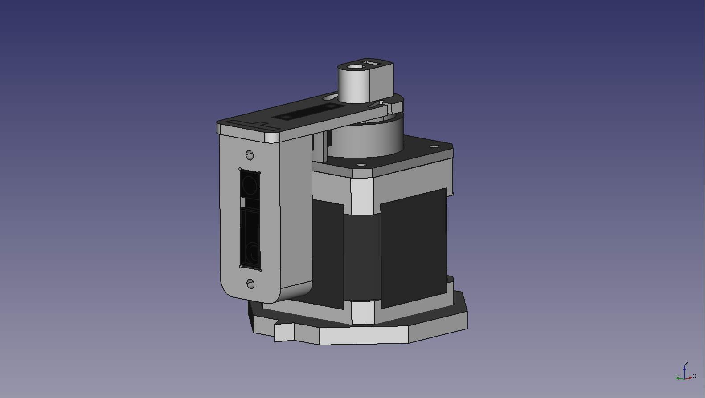

Design files (HW/SW/MECH) for a motorized distance sensor to perform 360° scans.

Designed using:
* [FreeCAD](https://www.freecadweb.org)
* [KiCad EDA](http://kicad-pcb.org)
* [System Workbench for STM32](http://www.openstm32.org/HomePage)
